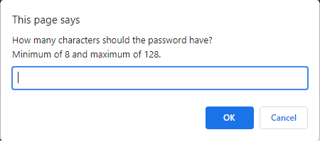
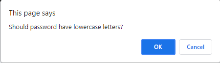

# Password Generator
This application was made with HTML and CSS and powered javascript. It is run in the user's browser of choice. Its purpose is to create a random password for the user with their choice of length and the type of characters included in the password.

## Features:
```
User clicks the button labeled "Generate Password" then presented with a series of prompts for password criteria. First, the user is asked the length of the password between 8 characters and 128 characters. After providing a valid number of characters the user is then prompted for character types to include in the password. They can choose to include lowercase letters, uppercase letters, numbers, and/or special characters. Finally, a password is generated that matches the selected criteria which is written on the webpage.
```

## Screenshots:

```
A password is generated once the user pushes the button and provides the necessary criteria.
```

```
User is allowed to choose between 8-128 characters or cancel to stop the application.
```

```
After providing a valid number, the user is presented with four confirmations for the type of characters to include.
```

Link to application: https://ronarceo.github.io/Password-Generator/